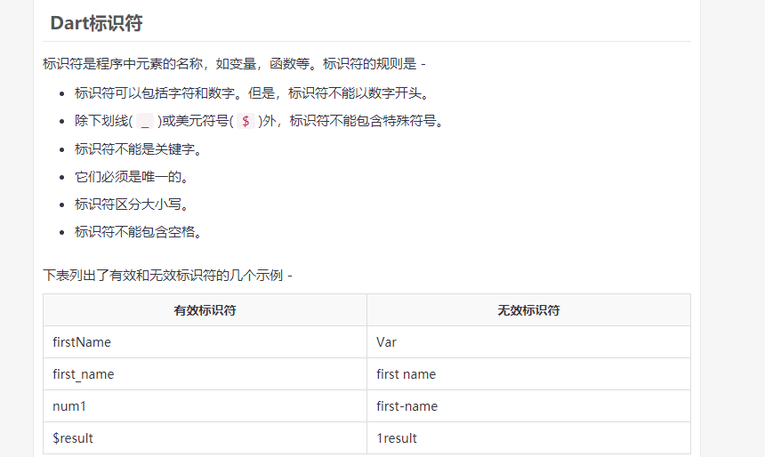
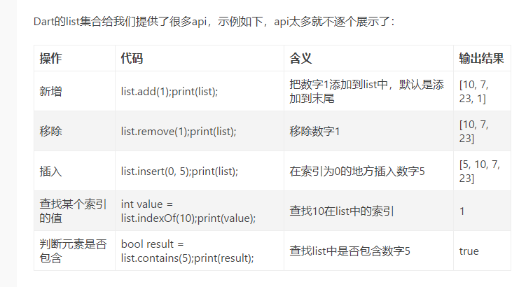

# Flutter 学习笔记

## 第一章 基础语法
标识符是程序中元素的名称，如变量，函数等。标识符的规则是 - 

#### 标识符:

#### 空白和换行:
Dart忽略程序中出现的空格，制表符和换行符。可以在程序中自由使用空格，制表符和换行符，并且可以自由地以简洁一致的方式格式化和缩进程序，使代码易于阅读和理解。

## Dart面向对象编程

1. 对象 - 对象是任何实体的实时表示。每个对象必须具有三个功能：  
①状态 - 由对象的属性描述  
②行为 - 描述对象的方式  
③标识 - 将对象与一组类似此类的对象区分开的唯一值。
2. 类 - 类封装了对象的数据
3. 方法 - 方法促进对象间的通信

## 第二章 数据类型

### 1. 数字类型
Dart中的数字类型用于表示数字文字。Dart中的数字类型有两种类型
* 整数 -  整数值表示非小数值，即没有小数点的数值。例如，10是整数。使用int关键字表示整数文字。
* 双精度数  -  Dart还支持小数数值，即带小数点的值。Dart中的Double数据类型表示64位(双精度)浮点数。例如，10.10。关键字**double**用于表示浮点文字。

